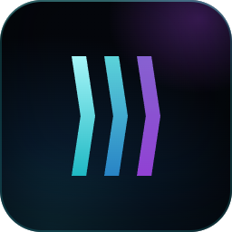
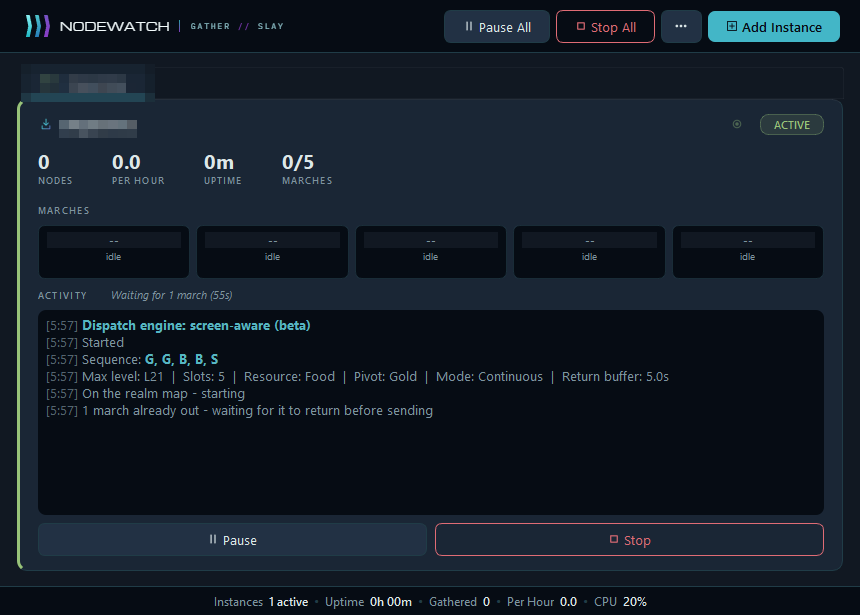
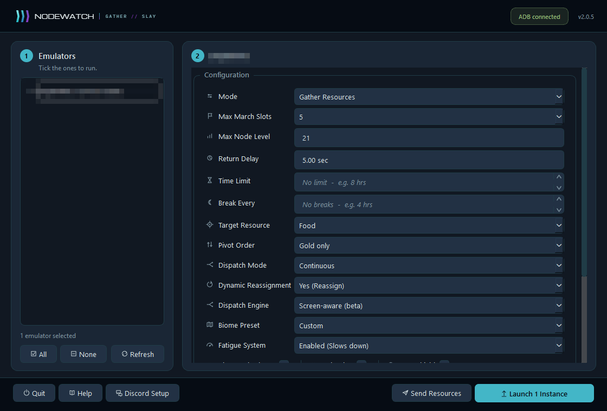
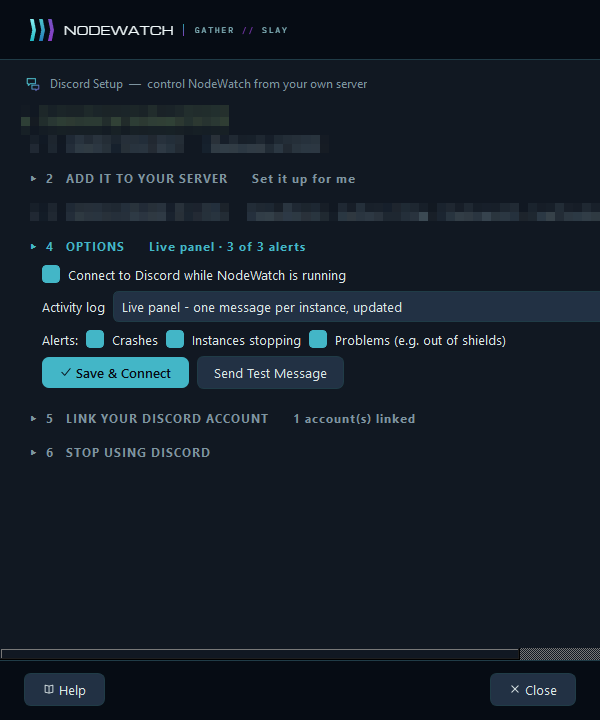
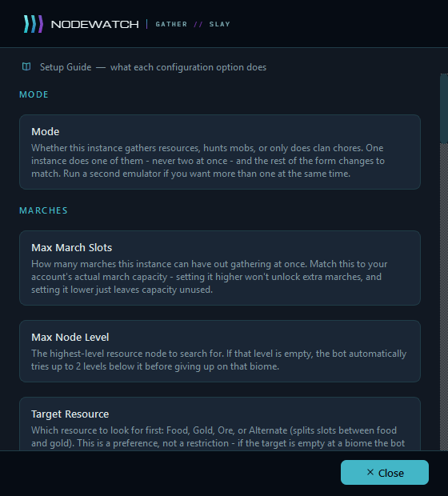

**Hands-off gathering, hunting and clan chores for Android emulators — watched from your desktop or your phone.**

[Features](#-features) · [Screenshots](#-screenshots) · [Install](#-install) · [Discord control](#-control-it-from-discord) · [Updates](#-updates) · [FAQ](#-faq)

---

## ✨ Features

<table>
<tr>
<td width="50%" valign="top">

### 🧭 Three ways to run
- **Gather Resources**: keeps every march slot busy on the resources and levels you choose, with automatic fallbacks when a resource runs dry.
- **Slay Mobs**: finds, checks and attacks mobs at the level you set, with a limit on how much it spends.
- **Clan Chores Only**: clears chests and helps the clan, with the game closed in between.

</td>
<td width="50%" valign="top">

### 🖥️ Many instances, one window
- Run several emulator instances side by side (BlueStacks, MEmu, Nox or LDPlayer), each with its own settings.
- Live cards show each instance's status, march timers and progress.
- Settings are remembered per instance, and **Copy to All** reuses one setup everywhere.

</td>
</tr>
<tr>
<td valign="top">

### 🧑 Plays like a person
- Taps land on a different spot each time, with natural press lengths and reaction pauses.
- Gets slower as a session goes on, and takes breaks that close the game.
- Idles the way people do: opening menus, checking timers, glancing at a profile.

</td>
<td valign="top">

### 🛡️ Careful by default
- Checks what it found before committing a march, and backs out if it's wrong.
- Waits for marches that are already out instead of overfilling the queue.
- Reads the screen to recover from popups, city view and lost connections.
- Optional **Auto Shield** keeps your shield up.

</td>
</tr>
<tr>
<td valign="top">

### 📱 Discord remote control
- Start, stop, restart and check on instances from your phone.
- Change settings with a dropdown panel: no typing.
- Alerts when something needs you, and a live log channel.

</td>
<td valign="top">

### 🔄 Always current
- Signed updates install themselves in one click, and your settings are kept.
- Minimises to the system tray and keeps working.

</td>
</tr>
</table>

---

## 📸 Screenshots

<table>
<tr>
<td align="center" width="50%">
 
<b>Setup</b>: tick your emulators, choose each one's settings, launch.
</td>
<td align="center" width="50%">
 
<b>Dashboard</b>: every instance, its marches and its activity log at a glance.
</td>
</tr>
<tr>
<td align="center">
 
<b>Discord Setup</b>: step by step, or let NodeWatch create its own channels.
</td>
<td align="center">
 
<b>Built-in guide</b> explaining every setting.
</td>
</tr>
</table>

---

## 🚀 Install

1. Download **`NodeWatch-Setup-<version>.exe`** from the [latest release](https://github.com/dberry03/Nodewatch/releases/latest).
2. Run it. It installs for your Windows account only, so no administrator rights are needed.
3. Start NodeWatch and enter your licence key when asked.

> [!IMPORTANT]
> Each emulator instance must be set to **1080 × 1920, portrait** in its display settings.
> NodeWatch checks this and won't launch an instance at any other resolution.

<b>Requirements</b>

| | |
|---|---|
| **OS** | Windows 10 or 11 (64-bit) |
| **Emulator** | BlueStacks 5, MEmu, Nox or LDPlayer, with ADB switched on |
| **Resolution** | 1080 × 1920 portrait, per instance |
| **Discord** *(optional)* | A free Discord bot you create; NodeWatch walks you through it |

---

## 🎮 Using it

1. **Tick** the emulators you want to run on the left of the setup screen.
2. **Choose** each one's mode and settings. The `?` beside every option explains it.
3. **Launch.** Each instance gets its own card on the dashboard.

Pause, resume or stop any instance from its card, or everything at once from the top bar. Close the window and NodeWatch offers to keep running in the tray.

<b>Gathering settings at a glance</b>

| Setting | What it does |
|---|---|
| **March slots** | How many marches to keep busy (3–6) |
| **Max level** | The highest level to search for; drops a level or two if nothing's found |
| **Target resource** | Food, Gold, Ore, or alternating |
| **Pivot order** | What to try when the target resource runs out |
| **Biome preset** | Balanced across biomes, one biome, or custom per slot |
| **Dispatch mode** | *Continuous* refills each slot as it frees; *Batch* sends all, waits, repeats |
| **While waiting** | In Batch, close the game between batches or stay on the map |
| **Dispatch engine** | *Classic*, or *Screen-aware (beta)*: checks the screen after every tap and moves on as soon as the game is ready |
| **Breaks / time limit** | Rest every few hours, or stop after a set time |
| **Clan chores** | Clear mob chests, help the clan, keep a shield up |

---

## 💬 Control it from Discord

Set it up once from **Discord Setup** in NodeWatch. It walks you through creating a bot, or creates its own private channels for you. Then, from any device:

| Command | |
|---|---|
| `/status` | What's running, for how long, how much it's done |
| `/start` · `/stop` · `/restart` | Start with saved settings (opening the emulator if needed), stop, or restart the emulator and game |
| `/pause` · `/resume` | Pause or resume an instance |
| `/edit` | **Change an instance's settings with dropdowns** |
| `/settings` | The saved settings `/start` would use |
| `/log` · `/screenshot` | Recent activity, or what the screen shows right now |
| `/chests` · `/help-clan` · `/shield` | Run a chore now instead of waiting |
| `/emulators` · `/open` | See every emulator instance; open one without starting |
| `/mute` | Silence alerts for a few hours |

> [!NOTE]
> Discord is optional. NodeWatch works exactly the same without it.

---

## 🔄 Updates

NodeWatch checks for a new version once a day and offers it when nothing is running. Updates are **signed**: the app only installs a release it can verify came from us, and it keeps your settings, saved instances and licence.

You can also check any time from the **⋯** menu → **Check for Updates**.

---

## ❓ FAQ

<b>It says my emulator is the wrong resolution.</b>

Set that instance to 1080 × 1920 portrait in the emulator's display settings, restart the instance, then press **Refresh** in NodeWatch.

<b>Which emulators does it work with?</b>

BlueStacks 5, MEmu, Nox and LDPlayer. They're all found by **Refresh**, shown by the names you gave them, and can be opened, closed and restarted from Discord. BlueStacks has had the most testing; support for the other three is newer.

<b>Can I use my PC while it runs?</b>

Yes. NodeWatch talks to the emulator directly, not through your mouse and keyboard, so you can minimise everything and carry on.

<b>Something went wrong. How do I report it?</b>

Use **⋯ → Report a problem** in NodeWatch and say what you were doing. Nothing is ever sent automatically, and reports carry nothing that identifies you. Or ask in our [Discord](https://discord.gg/HCs2wAwmsx).

---

NodeWatch is an independent tool and is not affiliated with or endorsed by any game developer or publisher. Use it in line with the rules of the games you play.

