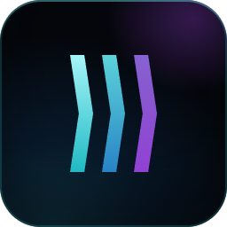
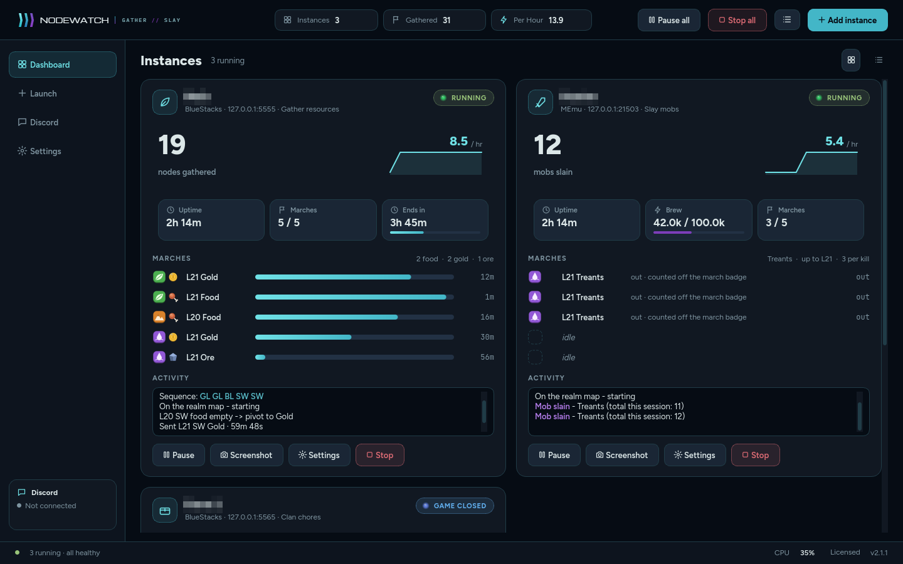
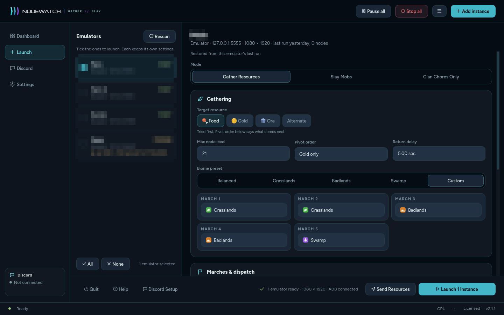
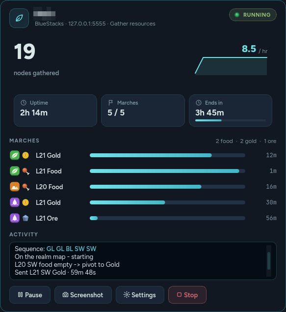
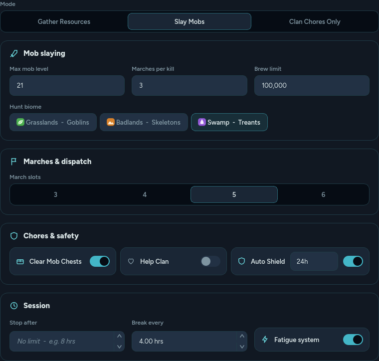
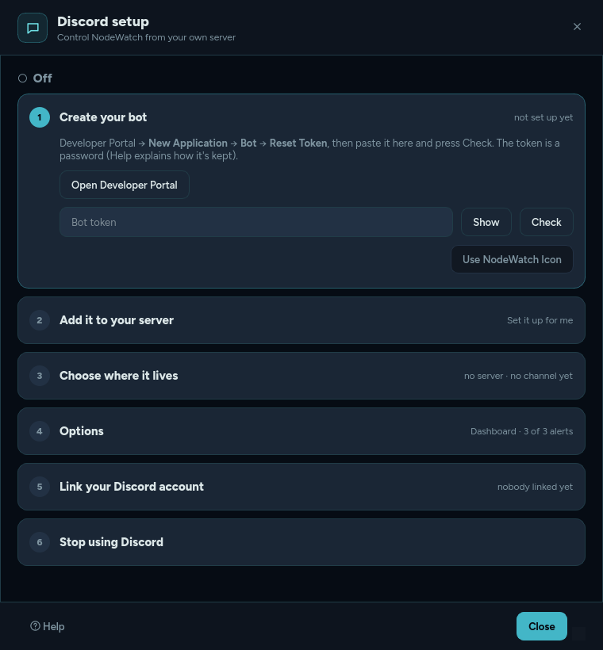
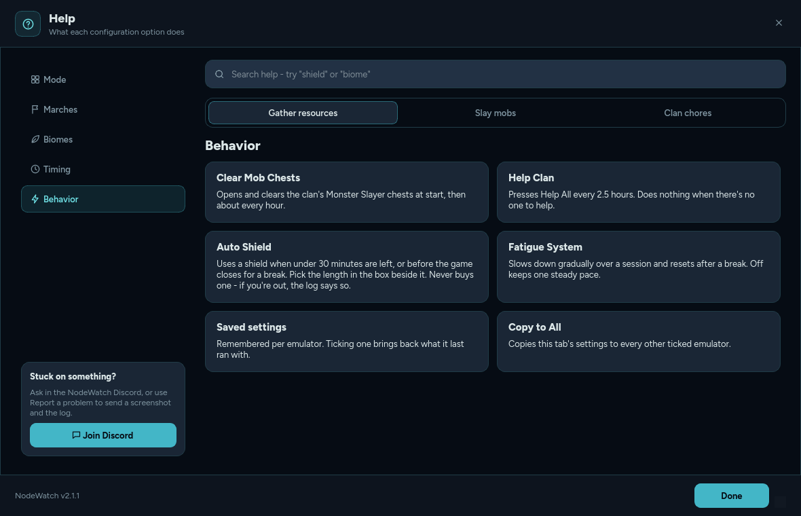

  

  

**Gathering, mob hunting and clan chores on your Android emulators, so you don't have to sit there tapping.**

[Features](#features) · [Screenshots](#screenshots) · [Install](#install) · [Using it](#using-it) · [Discord](#discord) · [Updates](#updates) · [FAQ](#faq)

---

## Features

<table>
<tr>
<td width="50%" valign="top">

### Three modes
- **Gather Resources.** Keeps your marches out on the resource, level and biomes you pick. If a resource is empty, it tries something else instead of leaving the slot sitting at home.
- **Slay Mobs.** Finds a mob at your level, makes sure it's the right one, and sends your marches at it. You can set a brew limit so it doesn't burn through everything.
- **Clan Chores Only.** Clears clan chests and helps the clan, then closes the game until the next visit. It figures out how often to come back based on how fast your tavern fills up.

</td>
<td width="50%" valign="top">

### Run a bunch at once
- BlueStacks, MEmu, Nox or LDPlayer, as many instances as your PC can handle. Each one gets its own mode and settings.
- Every instance has a card showing what it's doing, how fast it's going, and when each march gets back.
- It remembers each emulator's settings. Set one up and hit **Copy to all** if you want the rest the same.
- Minimize it to the tray and forget about it.

</td>
</tr>
<tr>
<td valign="top">

### Plays like a person
- Taps never land in the exact same spot twice, and the timing between them varies.
- Gets a little slower the longer it runs, and takes real breaks with the game closed.
- Pokes around between marches the way people do: opens a menu, checks a timer, closes it.

</td>
<td valign="top">

### Checks before it acts
- Checks the screen after every tap, so it moves on as soon as the game is ready and notices when something went sideways.
- Reads what it found before sending a march, and backs out if it's not what you asked for.
- If a popup, the city view or a disconnect gets in the way, it sorts itself out.
- **Auto Shield** puts up a shield when yours is about to run out. Pick the length. It won't buy one.
- Can clear mob chests and help the clan in any mode.

</td>
</tr>
<tr>
<td valign="top">

### Control it from Discord
- Each instance gets a card in your own Discord server with buttons to pause, stop, quit, check the log or grab a screenshot.
- Start, stop, restart and change settings from your phone. No typing commands out if you don't want to.
- Check your shield or pop a new one from anywhere.
- It pings you with a screenshot if something goes wrong.

</td>
<td valign="top">

### Updates itself
- New versions install in one click and keep your settings.
- There's a built-in guide for every setting, and a Report button if something breaks.

</td>
</tr>
</table>

---

## Screenshots

<table>
<tr>
<td align="center" width="50%">
 
Tick your emulators, set them up, launch.
</td>
<td align="center" width="50%">
 
One instance's card while it's gathering.
</td>
</tr>
<tr>
<td align="center">
 
Mob slaying settings.
</td>
<td align="center">
 
Discord setup walks you through it step by step.
</td>
</tr>
<tr>
<td align="center" colspan="2">
 
Not sure what a setting does? It's all in Help.
</td>
</tr>
</table>

---

## Install

1. Grab **`NodeWatch-Setup-<version>.exe`** from the [latest release](https://github.com/dberry03/Nodewatch/releases/latest).
2. Run it. It installs just for your Windows account, so you don't need admin rights.
3. Open NodeWatch and paste in your licence key. Keys work on one PC.

> [!IMPORTANT]
> Every emulator instance has to be set to **1080 × 1920 portrait** in its display settings. NodeWatch won't start an instance at any other resolution, because it wouldn't be able to find anything on screen.

<b>What you need</b>

| | |
|---|---|
| **Windows** | 10 or 11, 64-bit |
| **Emulator** | BlueStacks 5, MEmu, Nox or LDPlayer, with ADB turned on |
| **Resolution** | 1080 × 1920 portrait, on each instance |
| **Discord** *(optional)* | A free bot you make yourself. NodeWatch shows you how. |

---

## Using it

1. Tick the emulators you want on the Launch page.
2. Pick a mode for each one and set it up. Hover over anything for a quick tip, or hit **Help** for more.
3. Hit **Launch**. Each instance shows up as a card on the dashboard.

From a card you can pause, take a screenshot, change settings or stop it. Other buttons show up when you need them, like **Clear popups**, **End break now** or **Start again**. **Pause all** and **Stop all** are up top.

<b>Gathering settings</b>

| Setting | What it does |
|---|---|
| **March slots** | How many marches your account can have out (3 to 6) |
| **Target resource** | Food, Gold, Ore, or Alternate between food and gold |
| **Max node level** | Highest level it searches. Drops up to 2 levels if nothing's there |
| **Pivot order** | What to gather when your target isn't there |
| **Return delay** | A few extra seconds before it expects a march home |
| **Biome preset** | Spread across all biomes, stick to one, or pick per march |
| **Dispatch mode** | *Continuous* sends a march as soon as one gets home. *Batch* sends them all, waits for all of them, then repeats |
| **While waiting** | In Batch mode, close the game while marches are out, or stay on the map |
| **Dynamic reassignment** | Moves a march to another biome when its own runs dry |

<b>Mob slaying settings</b>

| Setting | What it does |
|---|---|
| **Max mob level** | Highest level it looks for (1 to 21). Drops up to 2 levels if nothing's there |
| **Hunt biome** | Grasslands, Badlands or Swamp. Each has its own mob |
| **Marches per kill** | How many marches it takes you to kill one. 3 works for most people |
| **Brew limit** | Stops before it spends more than this. 0 means no limit |
| **March slots** | How many marches your account can have out |

<b>Settings in every mode</b>

| Setting | What it does |
|---|---|
| **Clear Mob Chests** | Clears the clan's mob chests when it starts, then about once an hour |
| **Help Clan** | Hits Help All every couple of hours |
| **Auto Shield** | Puts up a shield (your pick of length) when the old one's nearly out, or before a break |
| **Stop after** | Stops after however many hours you set |
| **Break every** | Closes the game for an hour or two every few hours |
| **Fatigue system** | Slows down a bit over a long session |

---

## Discord

Discord's optional, but it's handy. Open **Discord Setup** in NodeWatch and it'll walk you through making your own bot. It can even set up its own private channels for you. After that you can do all of this from your phone:

| Command | |
|---|---|
| `/status` | What's running, how long it's been going, and how much it's done |
| `/start` · `/restart` | Start an instance with its saved settings (opens the emulator if it has to), or restart it |
| `/stop` | Stop now, or later with `after:2h` or `at:7am` |
| `/pause` · `/resume` | Pause or resume |
| `/edit` · `/set` | Change a stopped instance's settings |
| `/settings` | See the settings `/start` will use |
| `/log` · `/screenshot` | Recent activity, or what's on screen right now |
| `/clear` | Close whatever popup is in the way, then send a screenshot |
| `/diagnostic` | The last problem it ran into, with a picture |
| `/chests` · `/help-clan` | Do that chore right now |
| `/shield` | How much shield time is left. You can also use a new one from here |
| `/emulators` · `/open` · `/close` | See all your emulators, open one or close one |
| `/mute` | Turn alerts off for a few hours |

Every running instance also gets its own card in your channel. It shows what it's doing, each march with a countdown, and the latest log lines, with buttons for **Log**, **Screenshot**, **Settings**, **Pause**, **Stop** and **Quit**. **More** has the rest. Anything that would stop an instance asks you first. When an instance finishes, its card turns into a summary of the session.

Only the Discord accounts you link can use it, and only in your channel. Your bot token is stored encrypted.

> [!NOTE]
> You don't need Discord at all. NodeWatch works the same without it.

---

## Updates

NodeWatch checks for updates once a day and lets you know when nothing's running. Every update is signed, so it'll only install one that really came from me. Your settings, saved instances and licence carry over.

You can check yourself anytime under **Settings → Check now**.

---

## FAQ

<b>It says my emulator is the wrong resolution.</b>

Go into that emulator's display settings and set it to 1080 × 1920 portrait. Restart it, then hit **Rescan** in NodeWatch.

<b>Which emulators does it work with?</b>

BlueStacks 5, MEmu, Nox and LDPlayer. NodeWatch finds them on its own and shows them by the names you gave them. You can also open, close and restart them from Discord. BlueStacks has had the most testing so far.

<b>Can I still use my PC while it's running?</b>

Yep. It talks to the emulator directly instead of moving your mouse around, so go ahead and minimize everything.

<b>I got a new PC and my key stopped working.</b>

Keys are tied to one PC. Copy your machine ID from **Settings** and ask in the [Discord](https://discord.gg/HCs2wAwmsx) for a new key.

<b>Something's not working. How do I report it?</b>

Hit **Report** on that instance's card, or go to **Settings → Report a problem**. You'll see exactly what gets sent before it goes. Nothing is ever sent on its own, and nothing in it identifies you. You can also just ask in the [Discord](https://discord.gg/HCs2wAwmsx).

---

NodeWatch is an independent project and isn't affiliated with or endorsed by any game developer or publisher. Please use it within the rules of the games you play.

